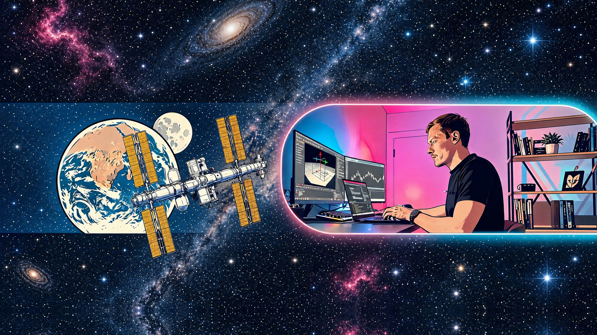

# Universe Zoom 🌌

**Live: [2themooon.github.io/universe-zoom](https://2themooon.github.io/universe-zoom/)**

An interactive logarithmic zoom across **27 orders of magnitude** — from a human hand to the edge of the observable Universe. Real distances, real astronomical catalogs, no fantasy artwork.

▶️ Watch the guided tour on YouTube: [@2-TheMoon](https://www.youtube.com/@2-TheMoon)

## What's real here

- **Distances** — genuine: orbital semi-major axes, stellar parallaxes, galaxy redshifts.
- **Stars** — the HYG catalog (Hipparcos + Yale + Gliese), ~118,000 stars with real coordinates and colors derived from their B−V index.
- **Galaxies** — the 2MRS catalog, 44,599 objects of the nearby Universe.
- **The Milky Way and the cosmic web** — procedural models built from published parameters (disk scale length 2.6 kpc, the Sun at 8.178 kpc from the galactic center).
- Planet sizes are exaggerated — at true scale the Solar System would look like an empty black circle.

## Features

- Pure **WebGL2**, zero runtime dependencies.
- Procedural audio synthesized in the browser, tied to the logarithm of scale (Shepard tone).
- Guided tour mode and a free-flight mode (mouse wheel to zoom, drag to rotate; pinch on touch screens).
- Localized into 6 languages: English, Russian, Spanish, Portuguese, Hindi, Chinese.

## Repository contents

This repository hosts the **built site** (GitHub Pages); application sources are not published here.

| Path | Description |
|---|---|
| `index.html` | Single-page app entry point (loader, UI markup, analytics beacon) |
| `assets/` | Bundled JavaScript and CSS (built with Vite) |
| `data/*.uzc` | Star and galaxy catalogs in a compact custom binary format |
| `music.mp3` | Ambient background music loop for the site |
| `banner.jpg` | Channel banner artwork |
| `README.md` | This file |
